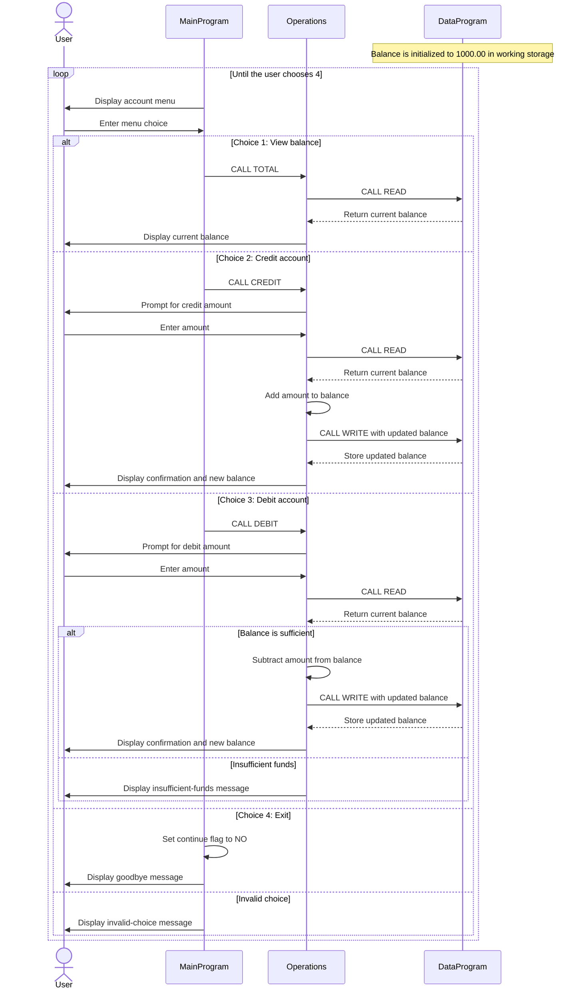

# COBOL Student Account Program

This directory documents the COBOL account-management example in `src/cobol/`.
The current implementation manages one generic account; it does not store
student names, IDs, or multiple student accounts.

## Source Files

- [`main.cob`](../src/cobol/main.cob) contains the interactive entry point. Its
  `MAIN-LOGIC` paragraph displays a menu, reads a choice, and calls
  `Operations` with `TOTAL`, `CREDIT`, or `DEBIT`. Choosing 4 exits the loop;
  other choices display an error message.
- [`operations.cob`](../src/cobol/operations.cob) implements the account
  actions. It reads and displays the balance for `TOTAL`, prompts for an amount
  and updates the balance for `CREDIT`, and prompts for an amount and applies
  `DEBIT` when funds are sufficient. It communicates with `DataProgram` to
  read and write the balance.
- [`data.cob`](../src/cobol/data.cob) owns the balance in working storage. Its
  procedure accepts an operation and balance: `READ` copies the stored balance
  to the caller, and `WRITE` replaces the stored balance.

## Student Account Rules

- The balance starts at `1000.00` when `DataProgram` initializes.
- The balance and transaction amount use `PIC 9(6)V99`, allowing six whole
  digits and two implied decimal places (up to `999999.99`).
- A debit is applied only when the current balance is greater than or equal to
  the requested amount. Otherwise, the program displays an insufficient-funds
  message and leaves the balance unchanged.
- A credit adds the entered amount to the balance. There is no explicit check
  for positive amounts or for exceeding the field's maximum value. Debit input
  likewise has no explicit positivity validation.
- Only one account is represented. The balance is held in program working
  storage, not in a file or database, so no durable student account records
  are provided.

## Application Data Flow

